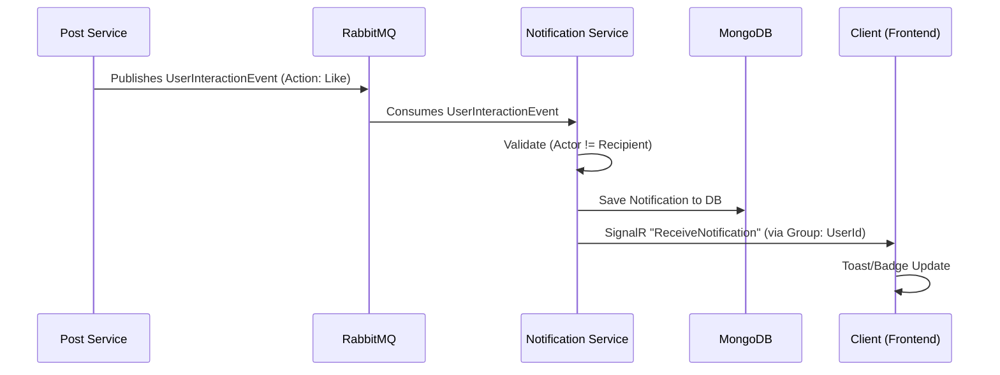
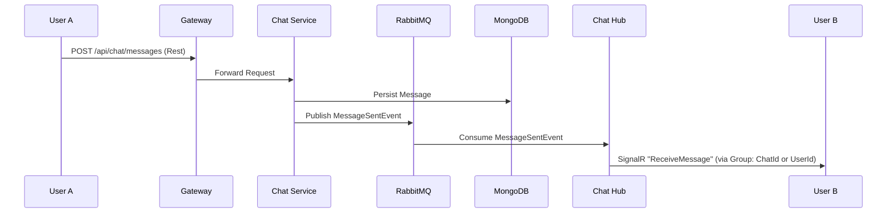

# Real-time Architecture

This document describes the real-time capabilities of the Sonixy platform, primarily driven by **SignalR** for delivery and **MassTransit + RabbitMQ** for event distribution.

## 1. Notification System

The Notification Service (`Sonixy.NotificationService`, port 8094) is responsible for delivering real-time updates to users when relevant events occur (e.g., likes, comments, replies).

### 1.1 Architecture Flow

### 1.2 Key Components

- **Event Source**: Microservices (like PostService, SocialService) publish integration events (e.g., `UserInteractionEvent`) to RabbitMQ.
- **Consumer**: `UserInteractionConsumer` in the Notification Service listens for these events.
- **Persistence**: Notifications are stored in MongoDB (`sonixy_notifications`) for history.
- **SignalR Hub**: `NotificationHub` (`/hubs/notifications`) manages connections.
  - **Auth**: Uses JWT Bearer tokens (via Query String `access_token` for WebSocket compatibility).
  - **Groups**: On connection, users are automatically added to a group named after their `UserId`.
- **Client**: The frontend (`NotificationContext`) connects to the hub and listens for the `ReceiveNotification` event.

### 1.3 Technology Stack

- **Broker**: RabbitMQ (MassTransit abstraction).
- **Transport**: WebSockets (primarly), Server-Sent Events/Long Polling (fallback).
- **Protocol**: SignalR Hub Protocol.

---

## 2. Future Chat System (Planned)

The Chat System will extend the existing real-time infrastructure, reusing the established patterns for scalability and reliability.

### 2.1 Proposed Architecture

### 2.2 Design Principles (Shared with Notifications)

1.  **Hybrid Approach**:
    - **REST API** for sending messages (reliable, easier to validate/rate-limit).
    - **SignalR** primarily for *receiving* updates (push model).
2.  **Persistence First**: Messages are saved to the DB before being pushed to ensure consistency.
3.  **Group Management**:
    - **Notifications**: 1-to-1 (System to User). Group = `UserId`.
    - **Chat**: 1-to-Many (User to Room). Group = `ChatId` or `ConversationId`.
4.  **Scaling**:
    - Use **Redis Backplane** for SignalR if scaling to multiple instances of Notification/Chat services.

### 2.3 Data Model (Draft)

**Message**:
- `Id`: ObjectId
- `ConversationId`: ObjectId
- `SenderId`: string
- `Content`: string
- `Type`: "text" | "image" | "system"
- `CreatedAt`: DateTime
- `ReadBy`: List<string>

**Conversation**:
- `Id`: ObjectId
- `Participants`: List<string> (UserIds)
- `LastMessageAt`: DateTime
