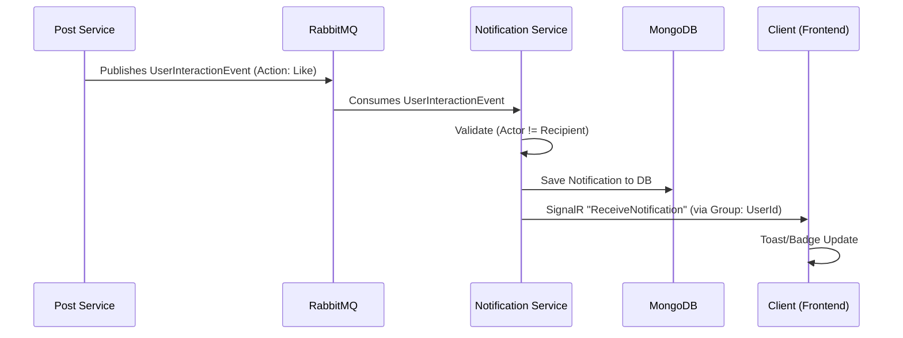
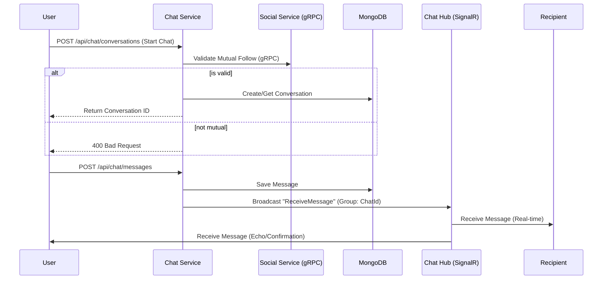

# Real-time Architecture

This document describes the real-time capabilities of the Sonixy platform, primarily driven by **SignalR** for delivery and **MassTransit + RabbitMQ** for event distribution.

## 1. Notification System

The Notification Service (`Sonixy.NotificationService`, port 8094) is responsible for delivering real-time updates to users when relevant events occur (e.g., likes, comments, replies).

### 1.1 Architecture Flow

### 1.2 Key Components

- **Event Source**: Microservices (like PostService, SocialService) publish integration events (e.g., `UserInteractionEvent`) to RabbitMQ.
- **Consumer**: `UserInteractionConsumer` in the Notification Service listens for these events.
- **Persistence**: Notifications are stored in MongoDB (`sonixy_notifications`) for history.
- **SignalR Hub**: `NotificationHub` (`/hubs/notifications`) manages connections.
  - **Auth**: Uses JWT Bearer tokens (via Query String `access_token` for WebSocket compatibility).
  - **Groups**: On connection, users are automatically added to a group named after their `UserId`.
- **Client**: The frontend (`NotificationContext`) connects to the hub and listens for the `ReceiveNotification` event.

### 1.3 Technology Stack

- **Broker**: RabbitMQ (MassTransit abstraction).
- **Transport**: WebSockets (primarly), Server-Sent Events/Long Polling (fallback).
- **Protocol**: SignalR Hub Protocol.

---

## 2. Chat System

The Chat System is now fully implemented, leveraging SignalR for real-time delivery and gRPC for inter-service validation.

### 2.1 Architecture Flow

### 2.2 Key Features Implemented

1.  **Hybrid Transport**:
    - **REST API**: Used for all state-changing actions (sending messages, creating conversations) to ensure proper validation, rate-limiting, and response handling.
    - **SignalR**: Used exclusively for *pushing* updates to clients. Clients do not send messages over SignalR.
2.  **Smart Deduplication**:
    - **Optimistic UI**: Frontend adds messages immediately.
    - **SignalR Filtering**: Frontend filters out "echo" messages from the sender to prevent duplication, while ensuring consistency.
3.  **Strict Privacy**:
    - **Mutual Follow Check**: Using gRPC to synchronously check `SocialGraphService` ensures users can only DM friends.
    - **Unique Conversations**: The system automatically detects and returns an existing private conversation if one exists, ensuring data integrity.
4.  **Presence**:
    - Redis is used to track online users (planned for expansion).

### 2.3 Data Model

**Message**:
- `Id`: ObjectId
- `ConversationId`: ObjectId
- `SenderId`: string
- `Content`: string
- `Type`: "text" | "image" | "system"
- `CreatedAt`: DateTime

**Conversation**:
- `Id`: ObjectId
- `Type`: "private" | "group"
- `Participants`: List<ChatParticipant>
- `LastMessageAt`: DateTime
